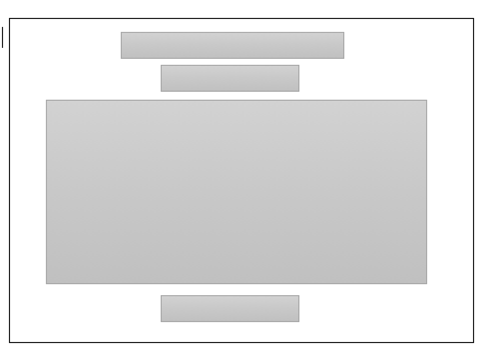
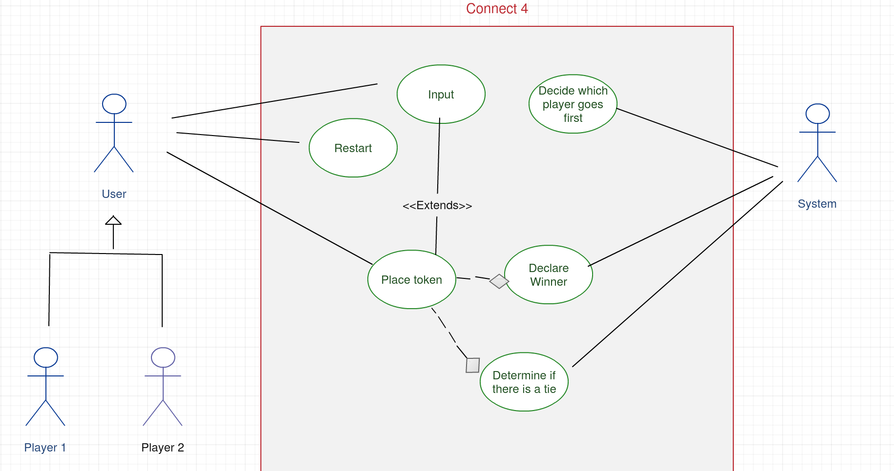

https://razan-1996.github.io/project1/connect4.html

# "Connect 4"

Overview:
Connect Four (Four Up, Plot Four, Find Four, Four in a Row, Four in a Line ,is a two-player connection game in which the players first choose a color and then take turns dropping colored discs from the top into a seven-column, six-row vertically suspended grid. The pieces fall straight down, occupying the next available space within the column. The objective of the game is to be the first to form a horizontal, vertical, or diagonal line of four of one's own discs. -- Wikipedia

 # "User Stories"
- The user should be able to click on a square to add marker first and then the other marker, and so on.
- The user should be shown a message after each turn, who's turn it is next.
- The user should be shown a message when I win, lose or tie.
-  The user should not be able to continue playing once I win, lose, or tie
- The user should be able to play the game again without refreshing the page (after finishing the game they can restart the game)

# "Technologies Used"
- Java jQuery
- html
- css

# "Link to wireframes"
- 

# "Daigram for planning"
- 

  
# features :
- Switch turns: between Player1 and Player2(or whichever markers you select)
- 7 colums ,6 rows
- design by many colors together 
- song
- anemation

# favourite part :
- Using CSS

# add next :
  - Make differnts leveles of the game by add the Input for rows and colums 
  - Inupt name for every user 

# something New :
- swal variable 
